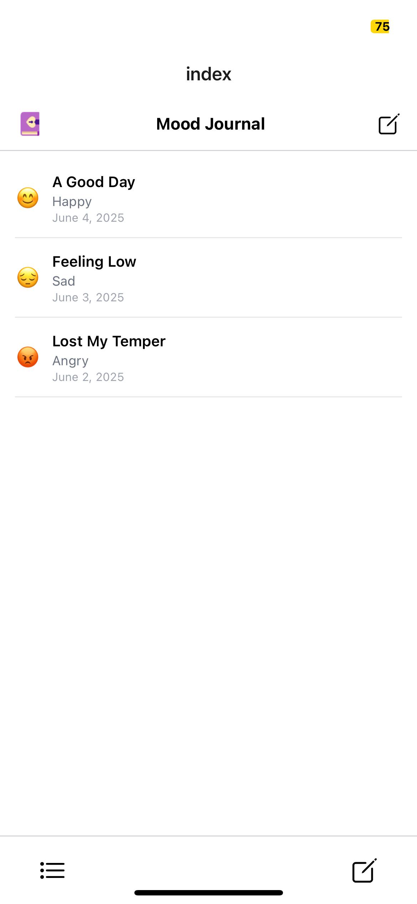
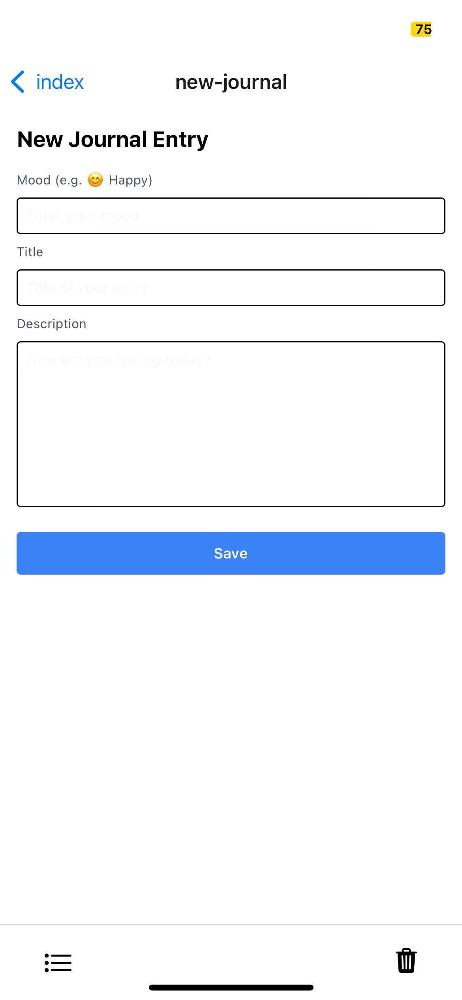

# Mood Journal App

A simple mood journaling app built with **React Native**, **Expo**, and **TypeScript**. This beginner-level project allows users to log daily moods and journal entries.

---

## 🚀 Technologies Used

- [React Native](https://reactnative.dev/)
- [Expo](https://expo.dev/)
- [TypeScript](https://www.typescriptlang.org/)
- [NativeWind (Tailwind CSS for React Native)](https://www.nativewind.dev/)
- [Expo Router](https://expo.github.io/router/)
- [Ionicons](https://icons.expo.fyi/)

---

## 🎨 Brief Design Rationale

The app focuses on simplicity and beginner-friendly design:

- A clean home screen with a list of journal entries.
- Use of emoji to visually represent moods.
- Easy navigation with a bottom tab bar.
- NativeWind used for quick and consistent styling.

---

## 🧠 Usability Heuristics Focused On

Based on [Nielsen Norman Group’s 10 Usability Heuristics](https://www.nngroup.com/articles/ten-usability-heuristics/), this app implements:

1. **Visibility of System Status** – The home screen immediately displays journal entries with mood and date.
2. **Match Between System and the Real World** – Uses everyday terms like “Happy,” “Sad,” and emojis for better user resonance.
3. **User Control and Freedom** – Clear navigation options with add/edit capability (via icon buttons).
4. **Consistency and Standards** – Native UI patterns and consistent styling with NativeWind.
5. **Aesthetic and Minimalist Design** – Focused on essential info only: mood, title, and date.

---

## 🛠️ How to Run the App Locally

1. **Clone the repository**:
   ```bash
   git clone https://github.com/your-username/mood-journal-app.git
   cd mood-journal-app

2. **Install dependencies**:
   ```bash
   npm install

3. **Start the Expo development server**:
   ```bash
   npx expo start

4. **Run on your device**:
- Scan the QR code in the terminal using the Expo Go app on your Android or iOS device.

---

## 📦 iOS Build with EAS
– ⚠️ Note: Unable to complete iOS build using EAS Build as it requires Apple Developer Program membership ($99/year), which I currently do not have access to.

---

## 🖼️ Screenshots

### 📱 Home Screen


### 📝 New Journal Screen


---

## 📚 Learning Resources Used

- [Expo Documentation](https://docs.expo.dev/)
- [React Native Docs](https://reactnative.dev/docs/getting-started)
- [Nielsen Norman Group – 10 Usability Heuristics](https://www.nngroup.com/articles/ten-usability-heuristics/)
- [NativeWind Docs](https://www.nativewind.dev/docs)
- [TypeScript Everyday Types](https://www.typescriptlang.org/docs/handbook/2/everyday-types.html)
- **YouTube Tutorials:**
  - [Expo + React Native Beginner Guide](https://www.youtube.com/watch?v=J2j1yk-34OY)
  - [React Native Journal App Build](https://www.youtube.com/watch?v=8336fcFV_T4)
  - [Tailwind CSS in React Native](https://www.youtube.com/watch?v=xy_zJwCuqsE)

---

## ✅ Status

- ✅ App UI complete  
- ✅ Functionality implemented with fake journal data  
- ✅ Navigation working  
- ✅ Tested on iPhone using Expo Go  
- ❌ EAS iOS build not completed  

---

## 🙌 Final Note

This is my **very first React Native + TypeScript** project.  
I learned everything from scratch using documentation, YouTube, and community help.  
Grateful for the learning journey! 🚀
